<h1 align="center">Ahoy World </h1>

<h3 align="center">
   I am <strong>Otsogile Onalepelo aka Morena</strong>
  <!---->
</h3>

<h2 align="center">
    Biomedical Engineer || AI Engineer || Software Engineer
</h2> 

I am an experienced self-taught software engineer, a qualified AI engineer and an allied health professional. A multipotentialite if you may. With the ability to quickly learn complex things on a need-to-know basis and apply them. My leisure time is spent researching and learning business & economic models, and how they can be optimized using technology.
What can i say? 🤷‍♂️ I am in love with learning, knowledge discovery and application.

## 🔭 I'm currently working on
- Building a portfolio and documenting my projects.
- An NFT market place cross platform mobile application.
- An NFT recommender system to incorporate into the NFT market place mobile application i am currently building.
- Maintaining some of my current projects.

## 🌱 I'm currently learning
- New AI & DL methods and models.
- Keeping myself updated with data related techniques and methods.
- Advanced programming skills.
- New programming languages, frameworks and libraries .

## 💼 Technical Skills

#### Front End:

  <code></code>
  <code></code>
  <code></code>
  <code></code>
  <code></code>
  <code></code>
  <code></code>
  <code></code>
  <code></code>
  <code>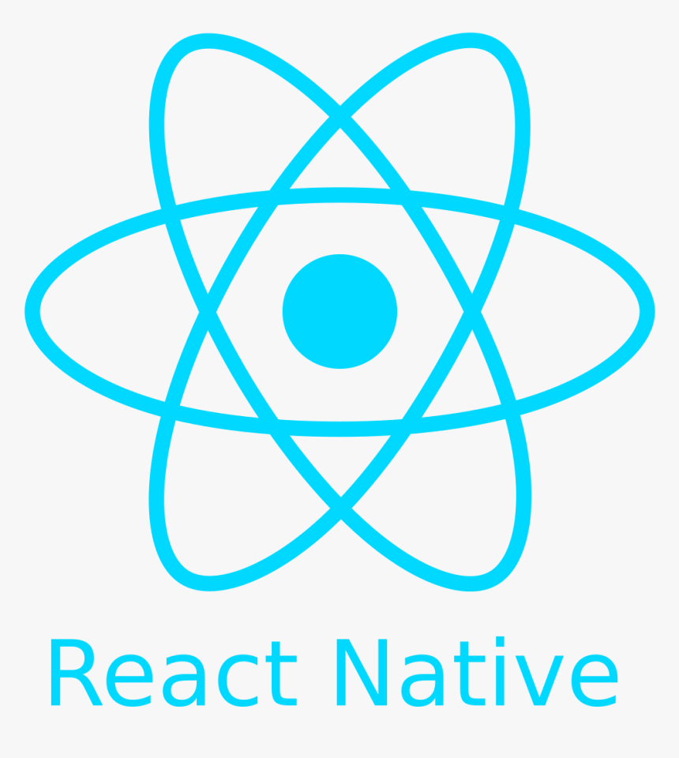</code>
  <code></code>
  <code></code>
  <code></code>
  <code></code>
  <code></code>

#### Back End:

   <code></code>
   <code></code>
   <code></code>
   <code></code>
   <code></code>
   <code></code>
   <code></code>
   <code></code>
   <code></code>
   <code></code>
   <code></code>
   <code></code>
   <code></code>\
   <code></code>

#### Artificial Intelligence:

    <code></code>
    <code></code>
    <code>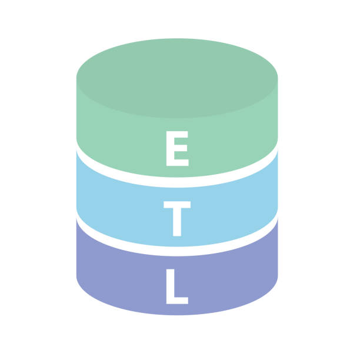</code>
    <code></code>
    <code>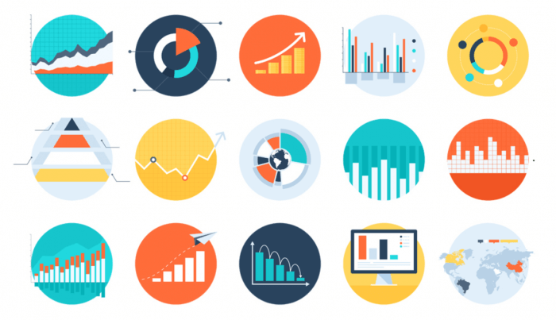</code>
    <code></code>
    <code></code>
    <code></code>
    <code>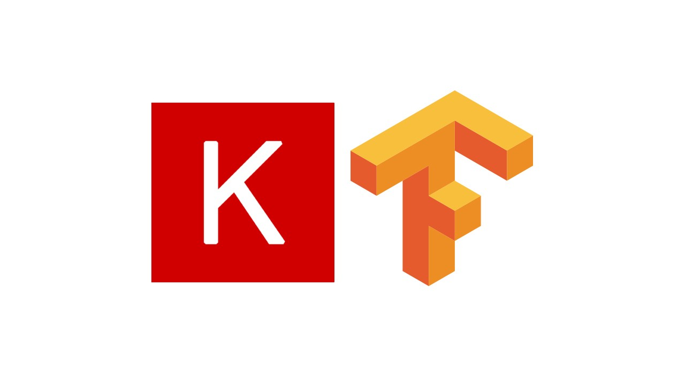</code>
    <code></code>
    <code></code>
    <code>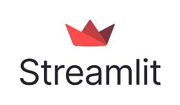</code>
    <code></code>
    <code>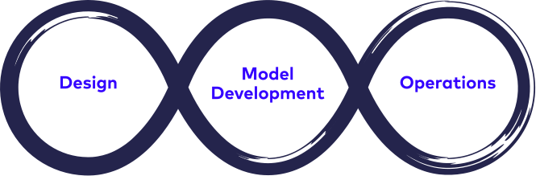</code>

#### Other Tools & Skills:

 
    <code></code>
    <code></code>
    <code></code>
    <code></code>
    <code></code>
    <code></code>
    <code>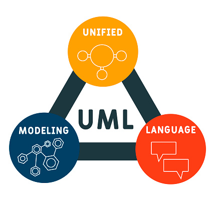</code>
    <code></code>
    <code></code>
    <code>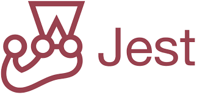</code>
    <code></code>
    <code></code>
    <code>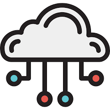</code>
    <code></code>
    <code>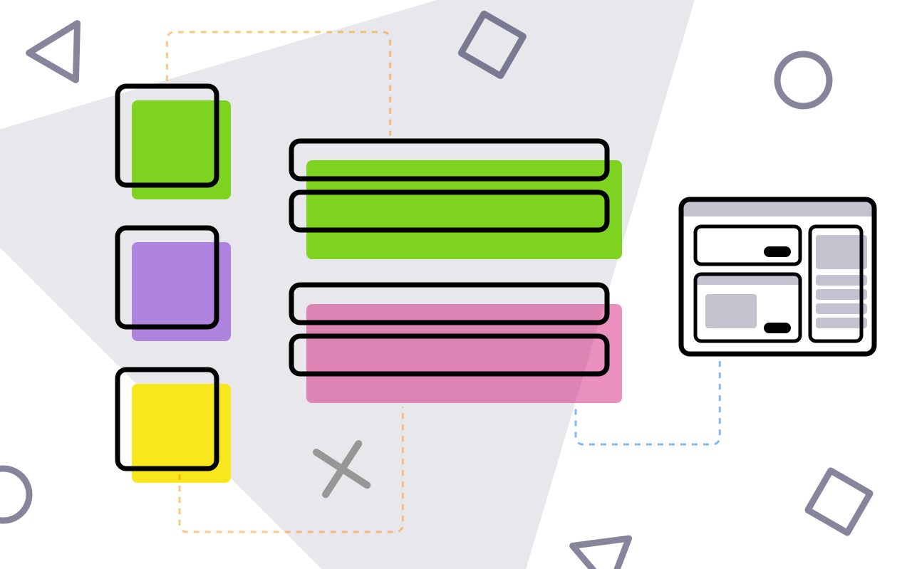</code>
    <code>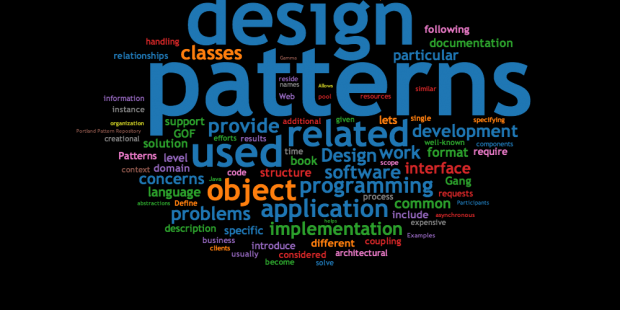</code>
    <code></code>
    <code></code>
    <code></code>

## 📈 GitHub Stats
<!-- https://github.com/anuraghazra/github-readme-stats -->

  
 

       
  
  

   
  

  
 

 

### 🤝 Get in touch:

    

 
- 💼 For any collaboaration or freelance work, lets connect => [email](mailto:hireme@morena.dev)
- 💬 If you have any questions/feedback, please do not hesitate to reach out to me!

⚡ Fun fact: Yay ! A different error message...Finally some progress 😆!

